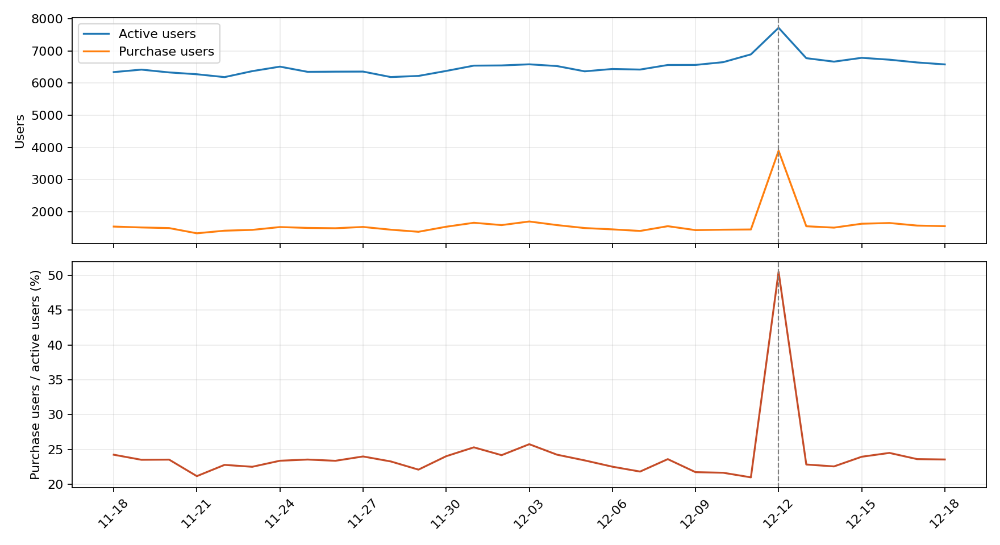

# 淘宝移动端用户购买路径与回访分析

基于[阿里天池“阿里移动推荐算法数据集”](https://tianchi.aliyun.com/dataset/46)的公开历史样本，使用 Python 标准库和 SQLite 分析用户行为。项目重点是可复现的指标口径、时间顺序审查与业务假设，**不是淘宝内部项目或真实运营增量评估**。

## 核心发现

- 样本包含 2014-11-18 至 2014-12-18 的 12,256,906 条行为记录、10,000 名抽样用户。
- 双十二当天购买用户率为 50.48%，前七日汇总口径为 22.26%。差异为 28.22 个百分点，属于观察性对比，不能归因于活动。
- 102,996 个发生过购买的用户商品组合中，83.79% 在首次购买同小时还有浏览、收藏或加购行为。时间只精确到小时，因此无法确定这部分行为的先后顺序。
- 五个字段完全相同的超额记录达 6,043,527 条。同小时重复行为和数据抽取重复无法区分，代码保留原始行，并优先使用去重用户、用户商品组合和跨日口径作结论。



完整解释见[分析报告](分析报告.md)。

## 复现

1. 从[原始数据集页面](https://tianchi.aliyun.com/dataset/46)获取数据，并核对数据集的使用说明。原始 CSV 不包含在本仓库。
2. 准备五列 CSV，列名依次为 `user_id,item_id,behavior_type,item_category,time`。此项目所用的本地文件名为 `user_action.csv`。
3. 运行：

```bash
python3 analyze.py --input /path/to/user_action.csv --output results
```

数据处理仅依赖 Python 标准库；安装 `matplotlib` 后还会输出趋势图。分析时会在系统临时目录创建 SQLite 数据库，结束后删除。请预留约 3 GB 磁盘空间。脚本包含记录数与关键汇总的断言校验。

## 仓库内容

- `analyze.py`：从原始 CSV 导入 SQLite、执行 SQL、输出汇总并绘图。
- `分析报告.md`：指标定义、发现、建议和局限。
- `results/`：汇总 CSV、JSON 和图表，不包含用户级原始数据。

## 解释边界

购买用户率是“当日购买用户 / 当日活跃用户”，不是曝光转化率；回访不是新客留存。数据没有订单号、金额、价格、广告曝光和实验分组，因此不计算 GMV、真实订单量或活动因果效果。匿名品类 ID 也不能直接解释成商品类型。
